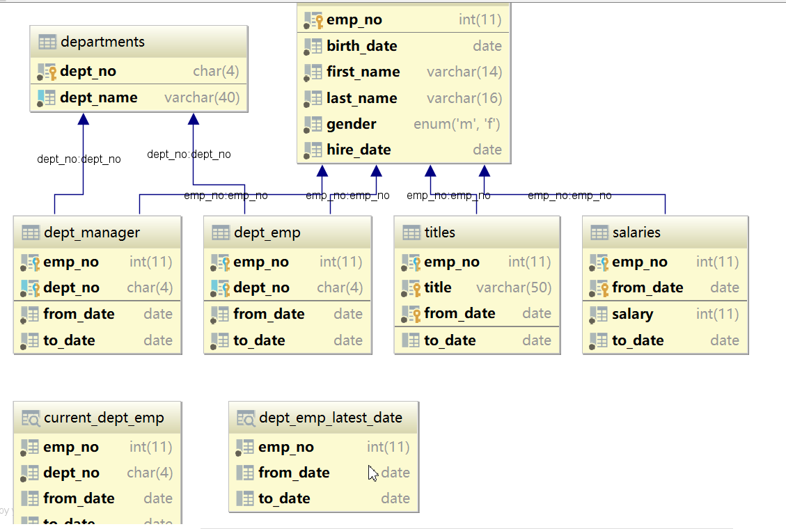

# 概述

## 环境

MySQL 8.0.18. 兼顾MySQL5.6

## 发现执行慢的查询

慢查询日志与分析

## 分析为什么执行慢

工具: EXPLAIN, SQL性能分析, optimizer trace...

## 调优理论

索引的原理, 创建索引的技巧,索引失效…

## 特定语句的原理与调优

JOIN、LIMIT、COUNT、GROUP BY、ORDER BY、表结构设计原则…

## 套件

Percona Toolkit

## 实战

foodie-dev项目慢查询调优实战

# 发现与分析

## 数据库调优的问题

调优金字塔:


所以尽量在低的地方做调优

### 业务需求

不合理的需求, 可能会造成很多问题
勇敢的对不合理的需求说不
拨乱反正

### 系统架构

做架构设计的时候,应充分考虑业务的实际情况,考虑好数据库的各种选择
读写分离?高可用?实例个数?分库分表?用什么数据库?

### SQL及索引

根据需求编写良好的SQL , 并去创建足够高效的索引

### 表结构

设计良好的表结构

### 数据库参数设置

设置合理的数据库性能参数
eg：join buffer、sort buffer…

### 系统配置

操作系统提供了各种资源使用策略,设置合理的配置, 以便于数据库充分利用资源
eg. swap -> swappiness

### 硬件

选用什么样配置的机器


## 测试数据准备与数据操作工具

导入测试数据.
MySQL官方测试数据库: [employee-data](https://dev.mysql.com/doc/index-other.html)
[github](https://github.com/datacharmer/test_db)

本地clone -> 上传到linux服务器 -> docker cp到mysql8.0.18的容器中

---

按照其中的`Installation`来进行安装

> mysql < employees.sql

报错:

```
ERROR 1045 (28000): Access denied for user 'root'@'localhost' (using password: NO)
```

需要使用

> mysql -u root -p -t < employees.sql
>
> 然后输入密码即可
>

测试:

mysql -u root -p -t < test_employees_md5.sql

ps:

直接ide连接然后run sql script即可.

其中的dump文件直接后缀该sql运行

---

idea/datagrip中连接到对应的database, 右击diagrams -> show visualization, 查看表之间的关系




## 慢日志查询

### 概念

慢查询日志是MySQL内置的一项功能, 可以记录执行超过指定时间的SQL语句

发现慢 SQL 的工具

- Skywalking
- VisualVM
- JavaMelody

### 慢查询日志相关参数及默认值

| 参数                                     | 作用                                                         | 默认值   |
| ---------------------------------------- | ------------------------------------------------------------ | -------- |
| log_output                               | 日志输出到哪儿, 默认FILE,  表示文件;设置成TABLE, 则将日志记录到mysql.slow_log中。也可设置多种格式, 比如fIle, TABLE | FILE     |
| long_query_time                          | 执行时间超过这么久才记录到慢查询日志, 单位秒, 可使用小数表示小于秒的时间 | 10       |
| log_queries_not_using_indexes            | 是否要将未使用索引的SQL记录到慢查询日志中, 此配置会无视long_query_time的的配置。生产环境建议关闭(关注是否快);开发环境建议开启(关注是否使用index, 调优) | OFF      |
| log_throttle_queries_not_ using_ indexes | 和log_queries_not_using_indexes配合使用, 如果log_queries_not_using indexes打开, 则该参数将限制每分钟写入的、未使用索引的SQL数量. 限流作用. | 0        |
| min_examined_row_limit                   | 扫描行数至少达到这么多才记录到慢查询日志                     | 0        |
| log_slow_admin_statements                | 是否要记录管理语句, 默认关闭。管理语句包括ALTER TABLE, ANALYZE TABLE,CHECK TABLE, CREATE INDEX, DROP INDEX, OPTIMIZE TABLE, and REPAIR TABLE。 | OFF      |
| slow_query_log_file                      | 指定慢查询日志文件路径                                       | /var路径 |
| log_slow_slave_statements                | 该参数在从库上设置, 决定是否记录在复制过程中超过long_query_time的SQL。如果binlog格式是row,则该参数无效. binlog格式是statement才有用 | OFF      |
| log_slow_extra                           | 当log_ output=FILE时, 是否要记录额外信息(MySQL 8.0.14开始提供), 对log_ output=TABL E的结果无影响。 | OFF      |

### 使用方式

#### 修改配置文件my.cnf

修改配置文件my.cnf, 在[mysqld]段落中加入如上参数即可

```mysql
[mysqld]
log_output ='FILE,TABLE' ;
s1ow_query_log = ON
long_query_time = 0.001
```

然后重启MySQL,例如:

> service mysqld restart

#### 通过全局变量设置

这种方式无需重启即可生效, 但一旦重启, 配置又会丢失。

```mysql
set global slow_query_log = 'ON';
set global log_output = 'FILE,TABLE';
set global long_query_time = 0.001;
```

这样设置之后, 就会将慢查询日志同时记录到文件以及mysql.slow_log表中。

这里使用方式2设置


# 调优理论(索引)


# 特定语句的原理与调优


# Percona Toolkit


# 实战


# ref

* [MySQL数据库监控与调优(1)](https://blog.csdn.net/weixin_42063050/article/details/114314069)

* [MySQL数据库监控与调优(2)](https://blog.csdn.net/weixin_42063050/article/details/114335314)


