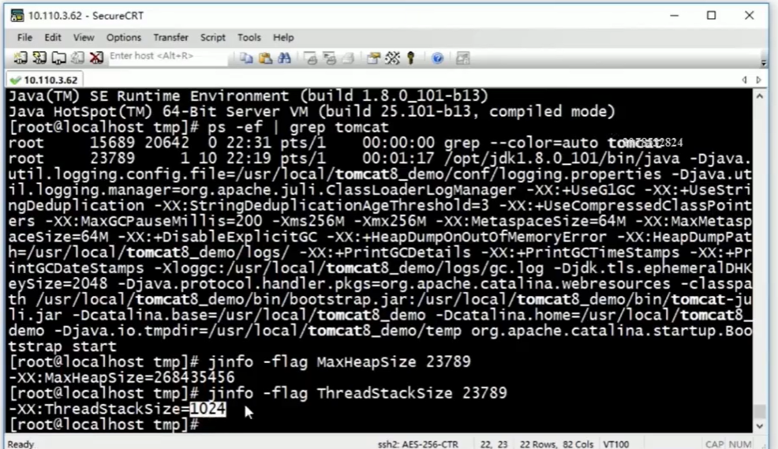
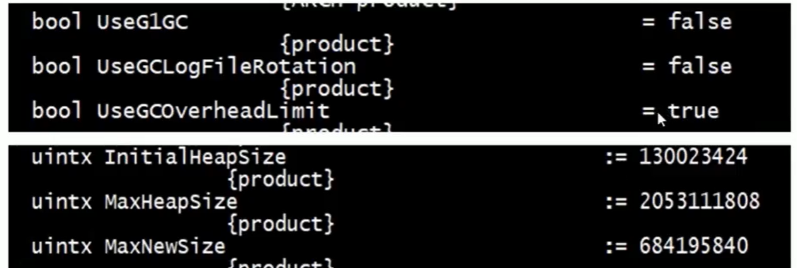
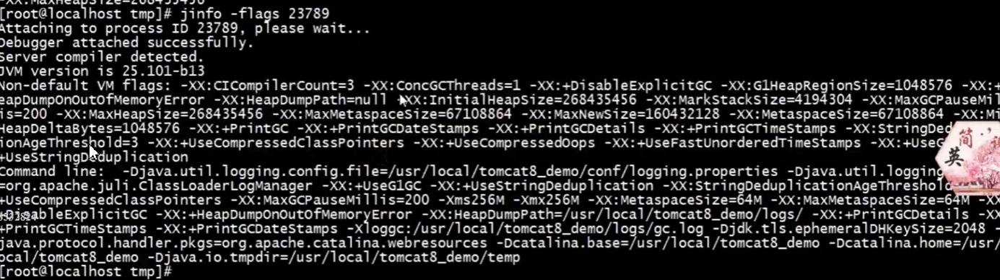

# 介绍

开发环境基本不用, 生产环境中重要

* 生产环境复杂: 硬盘问题, 网络问题, CPU利用率过高

* 生产环境问题定位困难

-> 对生产环境的监控很有必要

主要对Java应用的性能做监控与调优

## 内容

生产环境发生了内存溢出该如何处理？

生产环境应该给服务器分配多少内存合适？

如何对垃圾收集器的性能进行调优? -> 性能指标

生产环境CPU负载飙高该如何处理？

生产环境应该给应用分配多少线程合适？

不加log如何确定请求是否执行了某一行代码 -> 生产环境不可以调试

不加log如何实时查看某个方法的入参与返回值？

JVM的字节码是什么东西？ class文件

循环体中做字符串+拼接为什么效率低

字符串+拼接一定就是StringBuilder.append吗?

String常量池是咋回事？

i++与++i到底哪种写法效率更高？

...

## 目标

熟练使用各种监控和调试工具

生产环境中遇到的各种调试和性能问题

熟悉JVM的字节码指令 -> 源码看不清楚的问题, 需要深入到字节码中查看

理解JVM的自动内存回收机制, 学会GC调优

应对面试中关于性能调优和调试的问题


# 基于JDK命令行工具的监控

学习JDK的命令行监控工具的使用，包括jps、jinfo、jstat、jmap、jstack， 并结合MAT实战如何定位内存溢出，实战如何定位死循环和死锁。

主要内容: 

* JVM参数类型
* 查看运行时JVM参数
* 查看JVM统计信息
* **jmap+MAT**实战内存溢出
* jstack实战死循环与死锁

## JVM的参数类型

三大类型:

* 标准参数: 
  * -help
  * -server -client
  * -version -showversion
  * -cp -classpath
* -X参数: 非标准化参数. 在各个JVM版本中有可能变化(小)
  * -Xint：解释执行(完全解释执行, 不会把java代码转换成本地代码)
  * -Xcomp：第一次使用就编译成本地代码
  * -Xmixed：混合模式, JVM自己来决定是否编译成本地代码
  * java -version -> 可以通过java -Xint -version来修改
    java version "1.8.0_301"
    Java(TM) SE Runtime Environment (build 1.8.0_301-b09)
    Java HotSpot(TM) 64-Bit Server VM (build 25.301-b09, mixed mode)
* -XX参数(最常用): 非标转化参数, 相对不稳定, 主要用于JVM调优和Debug
  * Boolean类型
    * 格式: `-XX:[t-]<name>`表示启用或者禁用name属性
    * 例子: -XX:+UseConcMarkSweepGC(CMS垃圾处理器); -XX:+UseG1GC(G1垃圾处理器)
  * 非Boolean类型
    * 格式: `-XX：<name> = <value>`表示name属性的值是value
    * 例子:- XX:MaxGCPauseMillis=500(GC最大停留时间); XX:GCTimeRatio=19

---

-XmX, -Xms: 设置JVM的最大最小内存, 不是X参数，而是XX参数

* -Xms等价于-XX:InitialHeapSize

* -Xmx等价于-XX:MaxHeapSize

-Xss -> ThreadStatckSize




## 查看运行时JVM参数

查看命令[page](https://docs.oracle.com/javase/8/docs/technotes/tools/unix/index.html)


重要!

-XX:+PrintFlagslnitial: 查看初始值

-XX:+PrintFlagsFinal: 查看最终值

-XX:+UnlockExperimentalVMOptions解锁实验参数

-XX:+UnlockDiagnosticVMOptions解锁诊断参数

-XX:+UnlockDiagnosticVMOptions解锁诊断参数

### printFlagsFinal



=表示默认值

:=被用户或者JVM修改后的值

### jps

[jps](https://docs.oracle.com/javase/8/docs/technotes/tools/unix/jps.html#CHDCGECD)

查看java进程

```
> jps -l
9452 sun.tools.jps.Jps
```

### jinfo

prints Java configuration information for a specified Java process or core file or a remote debug server. The configuration information includes Java system properties and Java Virtual Machine (JVM) command-line flags.

正在运行JVM中的参数值

```
> jinfo -flag MaxHeapSize 23789
-XX:MaxHeapSize = 268435456
```



## jstat查看虚拟机统计信息

垃圾回收信息, 类加载信息, 代码编译信息

类装载

垃圾收集

JIT编译

```
>jstat -help
Usage: jstat -help|-options
       jstat -<option> [-t] [-h<lines>] <vmid> [<interval> [<count>]]

Definitions:
  <option>      An option reported by the -options option
  <vmid>        Virtual Machine Identifier. A vmid takes the following form:
                     <lvmid>[@<hostname>[:<port>]]
                Where <lvmid> is the local vm identifier for the target
                Java virtual machine, typically a process id; <hostname> is
                the name of the host running the target Java virtual machine;
                and <port> is the port number for the rmiregistry on the
                target host. See the jvmstat documentation for a more complete
                description of the Virtual Machine Identifier.
  <lines>       Number of samples between header lines.
  <interval>    Sampling interval. The following forms are allowed:
                    <n>["ms"|"s"]
                Where <n> is an integer and the suffix specifies the units as
                milliseconds("ms") or seconds("s"). The default units are "ms".
  <count>       Number of samples to take before terminating.
  -J<flag>      Pass <flag> directly to the runtime system.
```

options: -class, -compiler, -gc, -printcompilation


## jmap+MAT实战内存溢出


## jstack实战死循环与死锁

jstack用来打印线程


# 基于JVisualVM的可视化监控

学习可视化的监控工具JVisualVM的使用，学习如何用它来监控本地和远程的JAVA进程，包括监控内存、线程、方法执行时间等等。

## 监控本地JAVA进程


## 监控远程JAVA进程


# 基于Btrace的监控调试

学习如何安装btrace、如何编写btrace脚本来对生产环境下的代码进行监控调试，比如获取生产环境下某个方法的参数、返回值、异常、执行的行号等等。

类似于AOP的概念, 拦截


# Tomcat性能监控与调优 

学习如何在本地来远程调试tomcat和对tomcat服务器的内存、线程等做监控，会介绍两款监控工具---tomcat自带的manager和开源的psi-probe，然后会讲解常用的tomcat的调优的方法。

Tomcat远程debug, 生产不使用, 开发使用

Tomcat远程debug

Tomcat-manager监控Tomcat

psi-probe监控Tomcat


# Nginx性能监控与调优 

学习如何来安装nginx，并监控nginx的连接信息和请求信息，会介绍两款命令行工具ngx_http_stub_status和ngxtop，还有一款可视化工具nginx-rrd，然后会讲解常用的nginx的调优的方法。

ngx_http_stub_status监控连接信息

ngxtop监控请求信息

nginx-rrd图形化监控

nginx调优


# JVM层GC调优

学习JVM的内存结构，常见的垃圾回收算法和垃圾收集器，不同垃圾收集器的日志结构，然后介绍两款可视化的日志分析工具，通过分析日志得到GC的性能指标和出现GC的原因，最后带大家实战GC垃圾回收调优。

JDK1.8

JVM内存结构

垃圾回收算法

垃圾收集器

GC日志格式与可视化日志分析工具 -> 瓶颈, 优化标准, 分析日志

Tomcat调优实战


# JVM字节码与Java代码层调优

学习JVM的字节码指令，从字节码层面讲解一些常见问题的底层原理（面试能回答上的话， 绝对加分），比如：i++和++i哪一种效率高？循环体中做字符串+拼接为什么效率低？然后会重点对String做讲解，包括String常量池的变化、String字面常量、String.intern等，最后分享老师在开发中积累的常用的JAVA代码优化的20多条方法

JVM字节码指令与javap


# 课程总结


# Ref

- [Java生产环境下性能监控与调优详解](https://coding.imooc.com/class/241.html)